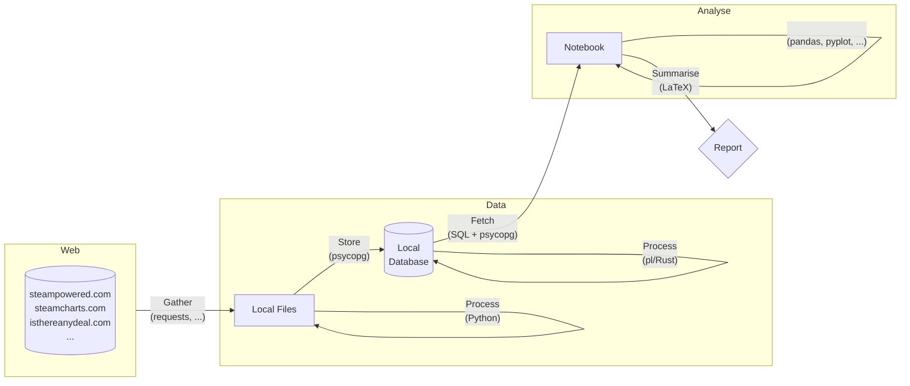

# 🎮 steam-insights

This repository houses my exploration into the vast world of the [Steam](https://store.steampowered.com) gaming platform. By gathering a rich array of metrics related to games available on Steam, ranging from historical pricing, and playercounts to genre classifications and hardware requirements, this project aims to unravel patterns, uncover insights, and highlight noteworthy trends within the gaming landscape. 

## 🏗️ Project Structure

The project structure is largely guided by the large amount of API calls (500K+) required to gather the selected data.
As a result all data is requested once from servers and stored into local files, before being filtered and processed and subsequently uploaded into a local database.
Within the analysis portion of the project, the data fetching is then replaced via calls to the database instead of repeated calls to the webservers.



## 📚 Gathering & Processing

The data gathering part of the project is done exclusively using Python's `requests` library in the form of a group of scripts within the `scripts` folder. A general outline of how the data is gathered is:

(Optional) create and initialise a virtual environment for the project, e.g. (on UNIX):
```
> py -m venv .venv
> source .venv/bin/activate
```

Install the necessary external libraries
```
> pip install -r requirements/gather.txt
```

Initialise the configuration file used by the scripts. This sets the `data` directory where the data is stored and read from, as well as the logging and state caching directories.
```
> py -m scripts.config
```

The configuration is backed by the `scripts/config.json` configuration file, which may be freely modified by the user. By default it is initialised with the values:
```json
{
    "root_dir": "/home/aritmos/dev/github/steam-insights",
    "prefix_root": true,
    "dirs": {
        "data": "data",
        "logs": ".logs",
        "state": ".state"
    },
    "logging": {
        "format": "{levelname:8} {message}"
    }
}
```
- If the `prefix_root` is set to `true`, then the `data_dir`, `logs_dir`, and `state_dir` paths are taken to be relative to the `root_dir` directory. If `prefix_root` is set to `false` then the directories are taken to be absolute paths, and `root_dir` is not used. This allows for the directories to be stored in different locations if wanted.
- The `logging->format` field specifies the logs formatting, see [`logging` docs](https://docs.python.org/3/library/logging.html).

All the scripts are python modules (so that they can) make use of this configuration file and hence **require passing the `-m` flag to the python interpreter**. The scripts write to files in the logs directory, using states stored in the states directory and manipulate data in the data directory. **Scripts can only be invoked from the project root**. All scripts make use of the `argparse` library to document functionality and parse arguments:
```
> py -m scripts.gather.steam.store -h
usage: scripts.gather.steam.store [-h] -a {info,reviews} -n NUMBER [-s SLEEP] [-m MANUAL]

Calls the selected API and stores the relevant object block of the specified AppIDs to file.
Automatically checks saved state from previous calls in order to select starting AppID.
Uses `<DATA_DIR>/raw/applist/applist.dat` to get an ordered list of AppIDs.
Using the list, starting at the given AppID, processes `-n/--number` AppIDs.
Continues on unsuccessful API calls (no store page exists); aborts on any error.


options:
  -h, --help            show this help message and exit
  -a {info,reviews}, --api {info,reviews}
                        [enum] selects which API to call
  -n NUMBER, --number NUMBER
                        [int] number of appids to process
  -s SLEEP, --sleep SLEEP
                        [float] seconds to sleep in between requests (default: 1.5)
  -m MANUAL, --manual MANUAL
                        [int] manually select start appid

IMPORTANT: Setting SLEEP < 1.5 with NUMBER > 200 requests will trigger an HTTP 429
```

## 💻 Storing

TODO: Local `PostgreSQL` database using `psycopg` for I/O and `pl/Rust` extension internally to manage complex querying. 

## 📊 Analyzing

TODO: `Jupyter` notebooks, using standard data-oriented libraries (`numpy`, `pandas`, `plotly`, ...) 

## ✍️ Summary

TODO: `LaTeX` writeup

