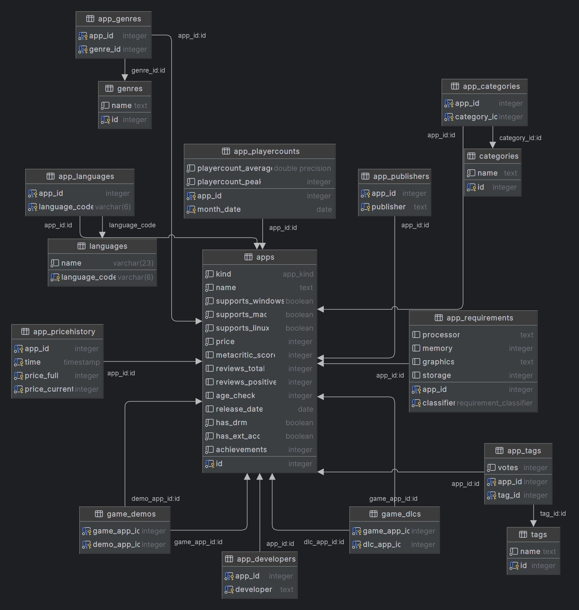

# 🎮 steam-explorer

This repository houses my exploration into the vast available data in the [Steam](https://store.steampowered.com) gaming platform. The project includes a rich array of game-related metrics, ranging from historical pricing and playercounts to genre classifications and hardware requirements. This project aims to unravel patterns, uncover insights, and highlight noteworthy trends within the gaming landscape. 

## 🏗️ Project Structure

The project structure is largely guided by the large data-gathering bottleneck of around 500,000 api calls required to gather a varied set of app-data:
- basic details (name, price, categories, languages, tags, developers, hardware requirements, ...)
- reviews
- historic prices
- playercounts

Basic details and reviews are gathered using the public steam apis (https://store.steampowered.com/api and https://api.steampowered.com), historic prices and playercounts are scraped from https://isthereanydeal.com/ and https://steamcharts.com/ . These latter two only contain a small subset of the apps gathered with the steam api; they are the only websites with their respective datasets that did not prohibit webscraping within terms of service.

I wanted to emulate the retrieval of the data from one common server within my analysis section therefore all the information is firstly gathered into disk, before being cleaned up and passed into a local (Postgres) database. Data analysis will be done with interactive python notebooks which are then compiled into a static website. The global workflow is as follows:

1. Gather (`requests`): Gather data from public and internal web APIs. Store raw information into disk.
2. Process (`python`): Clean up data, as well as producing necessary indexes for gathering additional data.
3. Upload (`Postgres` + `psycopg`): Create a local (Postgres) database and upload data.
4. Fetch (`psycopg` + `jupysql`): Fetch data from database using inline SQL in notebooks.
5. Analyse (`jupyterlab` + `myst-nb` + `pandas` + `seaborn`): Explore data, visualise trends, summarise findings.
6. Compile (`jupyter book`): Compile notebooks and markdown into a static site

**TODO**: Host the current state of the compiled website on GitHub pages.

## 🔎 Internals
### ⚙ Environments and Configuration

(Optional) create and initialise a virtual environment for the project, e.g. (on UNIX):
```
> py -m venv .venv
> source .venv/bin/activate
```

Install the necessary external libraries for your usecase
```
> pip install -r requirements/gather.txt
> pip install -r requirements/analyse.txt
```

Initialise the configuration file used by the scripts. This sets the `data` directory where the initial local files are stored and processed, as well as the logging and state caching directories.
```
> py -m src.config
```

The configuration is backed by the `src/config.json` configuration file, which may be freely modified by the user. By default it is initialised with the values:
```json
{
    "root_dir": "<project-root>",
    "prefix_root": true,
    "dirs": {
        "data": "data",
        "logs": ".logs",
        "state": ".state"
    },
    "logging": {
        "format": "{levelname:8} {message}"
    },
    "db": {
        "default_conn": "postgresql+psycopg",
        "host": "$winhost",
        "port": 5432,
        "user": "postgres",
        "password": true,
        "dbname": "steam-insights"
    }
}
```
- If the `prefix_root` is set to `true`, then the `data_dir`, `logs_dir`, and `state_dir` paths are taken to be relative to the `root_dir` directory. If `prefix_root` is set to `false` then the directories are taken to be absolute paths, and `root_dir` is not used. This allows for the directories to be stored in different locations if wanted.
- The `logging->format` field specifies the logs' formatting (see python [`logging` docs](https://docs.python.org/3/library/logging.html)).
- The `db` object stores data relating to the database connection.
    - The `host` field can have the special sentinel value of `$winhost`, used when the database service runs on a windows host, but the code is running from within WSL. In this case the windows host ip is retrieved from the `/etc/resolv.conf` file.
    - If the `password` field is set to true, the database password is looked up in a `db_password` field within a `SECRETS.json` file within the project root.

### Script Usage

All the scripts are python modules, able to relatively import the defined configuration. They therefore **always require passing the `-m` flag to the python interpreter**. 
Due to the large nature of the datasets and a non-server setup the scripts have been created to gather the data in batches. The process is fully automated by caching the script's state (files in the state directory) upon completion, with the user simply specifying how many requests to attempt at a time in these cases. In the case of an unexpected panic/exit (such as a `KeyboardInterrupt`) the scripts state will need to be updated using the logs file (as these files get updated upon the processing of every request).

The general data collection process is slow, limited by Steam's API limiting at 200 requests per 5 minutes. For the remaining websites with no apparent api limiting, a default sleep time of `3.0` seconds has been chosen in the main request loop, whenever possible I have contacted the site owners regarding the extended use of their internal APIs. Overall this amounts to around 100 hours of data collection if all the scripts are perfectly parallelised.  

For now **scripts can only be invoked from the project root**. All scripts make use of the `argparse` library to parse arguments, these aid in exposing general documentation:
```
> py -m src.scripts.gather.steam.store -h
usage: src.scripts.gather.steam.store [-h] -a {info,reviews} [-n NUMBER | -m MANUAL [MANUAL ...]] [-s SLEEP]

Calls the selected API and stores the relevant object block of the specified AppIDs to file.
Automatically checks saved state from previous calls in order to select starting AppID.
Uses `<DATA_DIR>/processed/indexes/appids.dat` to get an ordered list of AppIDs.
Using the list, starting at the given AppID, processes `-n/--number` AppIDs.
Continues on unsuccessful API calls (no store page exists); aborts on any error.

options:
  -h, --help            show this help message and exit
  -a {info,reviews}, --api {info,reviews}
                        [enum] selects which API to call
  -n NUMBER, --number NUMBER
                        [int] number of appids to process
  -m MANUAL [MANUAL ...], --manual MANUAL [MANUAL ...]
                        [int/list(int)] manually select appids
  -s SLEEP, --sleep SLEEP
                        [float] seconds to sleep in between requests (default: 1.5)

IMPORTANT: Setting SLEEP < 1.5 with NUMBER > 200 requests will trigger an HTTP 429
```

TODO: Data/script flowchart

### 💻 Storing

Once the data has been gathered and cleaned up in Python it is uploaded into a local Postgres database using [`psycopg`](https://pypi.org/project/psycopg/). Here is the current schema:



Database-related files—such as the schema, cleanup and common virtual tables—exist in the `src/db` directory of the project. The database is then queried within Jupyter notebooks via `psycopg`, `sqlalchemy` (for better interop with `pandas`), and `jupysql` for cell magic allowing raw SQL queries within notebooks. Originally I also wanted to try out [`pl/Rust`](https://github.com/tcdi/plrust) or [`pgrx`](https://github.com/pgcentralfoundation/pgrx) but these require the database to also be running on a UNIX system, and are not really needed given the robustness that `pandas` provides. 

### 📊 Analyzing

TODO: `Jupyter` notebooks,  (`pandas`, `seaborn`, `scipy` ...).
## ✍️ Summary

TODO: Notebooks along with markdown files are compiled into a static site using `Jupyter Book`.
